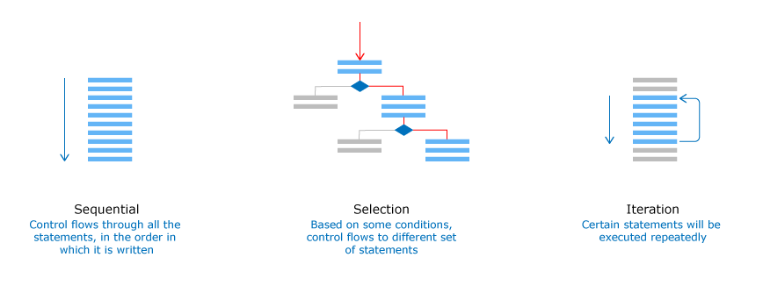
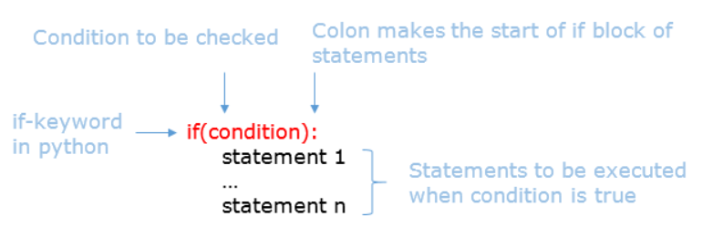

# python basics

## features of python :
```
 - It is opensource : Python's source code is free and anybody can use it in whatever the way they wanted it to be
- python is interpreted lanuage
- python is cross-platform compatible
- python is object oriented
- python is easy to learn and which make it as a great choice for new learners
 - python is extensible
- python is interactive
- database connectivity
```
## identifiers
- In python, variables, functions, classes, modules and objects are identified using a name known as **Identifier**
- An identifier can start with an uppercase or lowercase character or an underscore(_) followed by any number of underscores, letters and digits
- All identifiers in python are case sensitive
     Ex: weight = 17

    Here, weight is an identifier

## Keywords
- Keywords are the reserved words in python. So, keywords cannot be used as identifiers or to name variables and functions. Ex: if, else, elif, for, where, break, continue

## variables
  - Variables are like containers for data (i.e; they hold the data) and the value of the variable can vary throughout the program

    **Declaring a variable** :
```
 var_name = literal_value
```
- Here var_name is the name given to the container holding the value specified as literal_value in the syntax above

- In the above example, `weight` is the container holding the value 10 which can be changed during the execution of the program

- python data types used in programming are :

|category| Data type| Example|
|---|---|---|
|Numeric|int|123|
|Numeric with decimal point|Float|123.45|
|Alphanumeric|string|Hello|
|Boolean|Boolean|True, False|

- In python, data type of a variable is decided automatically at the time of execution based on the value assigned to it. This is called `dynamic typing`

- To check the datatype of a variable you can use type(var_name) which in turn returns the `datatype` of a variable

```python
num = 65
print(num, type(num))
num = 'A'
print(num, type(num))
```

## input && output funcitons

- python has a built-in input() built-in function to read an input from the user using standard input device (i.e; keyboard). 
- The input() function always returns string data irrespective of the type of data entered through keyboard

syntax: 
`var_name = input(["interactive statement"])`

Here, **var_name** is the variable assigned with the string value which is read using input method

**interactive statement** is the statement displayed to the user expecting the response from them

**print() function**

- Python provides the print() built-in function to display the output onto the standard output device (i.e; monitor)

syntax: `print("var_name1, var_name2, ...", [end="value1", sep="value2"])`

Here
```
- var_name1, var_name2 are the variable names or the literals you want to print or output

- `end` is used to specify the separator between two print statements which is `\n` by default

- `sep` is used to specify the separator between multiple variables displayed using a single print statement
```

## operators in python 

- operators in python are the symbols used to indicate the operation to be performed, some of the most common operators used in python are listed below :

|Category|Operators|
|---|---|
|Arithmetic Operators|+,-,*,/,%,//|
|Relational Operators|==,!=,>,<,>=,<=|
|Assignment Operators|=,+=, -=, *=,/=,%=|
|Logical Operatos| and, or, not|

**Arithmetic Operators**
|operator|Explanation|Example|
|---|---|---|
|+|user for addition operation| "+" is used as addition operator where 13 + 2 is evaluated as 15|
|-|used for subtraction operation|"-" is used as subtraction operator where 13-2 is evaluated 11 , 2-13 evaluated as -11|
|*|used for multiplication operation| '*' is used as multiplication operator where 11*2 is evaluated as 22|
|/|used for division operation|"/" is used as division operation where 13/2 is evaluated as 6.5|
|//|used for integer division operation|"//" is used for integer division where 13//2 is evaluated as 6|
|%|used for modulo operation. Consider the expression num1% num2 which finds the remainder after dividing num1 by num2|"%" is used as modulo operator where 13%2 is evaluated as 1 and 9%11 is evaluated as 9|


**Relational Operators**
|operator|Explanation|Example|
|---|---|---|
|==|used for checking the equality of two values/variables|10 == 10 is evaluated as True <br> 10 == 100 is evaluated as False|
|!=|Used for checking the inequality of two values/variables|10 != 10 is evaluated as False <br> 10 != 100 is evaluated as True |
|>|Used for checking if num1 is greater than num2 and is represented as num1 > num2| 10 > 10 is evaluated as False <br> 100 > 10 is evaluated as True|
|< |Used for checking if num1 is lesser than num2 and is represented as num1< num2|10 < 10 is evaluated as False <br> 10 < 100 is evaluated as True|
|>=|used for checking if num1 is greater than or equal to num2 and is represented as num1 >= num2| 10 >= 10 is evaluated as True <br> 10 >= 100 is evaluated as False|
|<=|used for checking if num1 is lesser than or equal to num2 and is represented as num1 <= num2|10 <= 10 is evaluted as True <br> 100 < = 10 is evaluated as False|


**Assignment Operatos**

|operator|Explanation|Example|
|---|---|---|
|=|used for assigning a value to a variable|num = 7 <br> Here num is assigned the value 7|
|+=|used as short hand assignment operator for addition|num=num+1 can also be represented as num+=1|
|-=|used as short hand assignment operator for subtraction|num=num-1 can also be represented as num-=1|
|*=|used as short hand assignment operator for multiplication|num=num*1 can also be represented as num*=1|
|/=|used as short hand assignment operator for division|num=num/1 can also be represented as num/=1|
|%=|used as short hand assignment operator for modulo operation|num=num%1 can also be represented as num%=1|


**Logical Operators**
|operator|Explanation|
|---|---|
|AND| Result will be true, if both the expressions are true. If any one or both the expressions are false, the result will be false|
|OR|Result will be true, even if one of the expression is true. If both the expressions are false, the result will be false|
|NOT|If the expression is true, results will be false and viceversa|


## Type Conversions in Python

- when you perform any operation on variables of different data types, the data of one variable will be converted to a higher data type among the two variables and the operation is completed. 
- This conversation is done by interpreter automatically and it is known as **implicit type conversion** . But, python doesnot support implicit type conversion and it will throw an error
- To avoid erros, we have to explicitly conver the the datatype of one variable into the required datatype to complete the operation. This is known as **"explicit type conversion"**

NOte : these rules differ from one programming language to another.

## comments in python
- Comments are the lines which are skipped during execution of a program
- There are two types of commnets available in python. They are 1. Single line comments and 2. Multi-line comments 


# Control structures in python
- Control statements are used to control the flow of exection of the program in python. 
- Commonly used control structures in python are : 1. sequential 2. selection 3. Iteration



**selection statements**:
- During the execution of a program, you may not wish to execute all set of statements sequentially, sometimes, you may wish to select between various set of statements based on some conditions. Depending on the test condition evaluation, the flow is determined within the program. 

**if :**
------
- It is a conditional statement used for decesion making in python. 
- In the **if** statement, the test condition is evaluated and statements inside the if block are executed only if the evaluated condition is True
- In the below if statement, you have only one set of statements to select based on the test condition. So, it is called **one-way selection** statement.



- python uses indentation to indicate a block of code. It will give you an error if you skip the indentation

**if-else:**
---------------
- it is a conditional statement used for selection
# Functions in python

